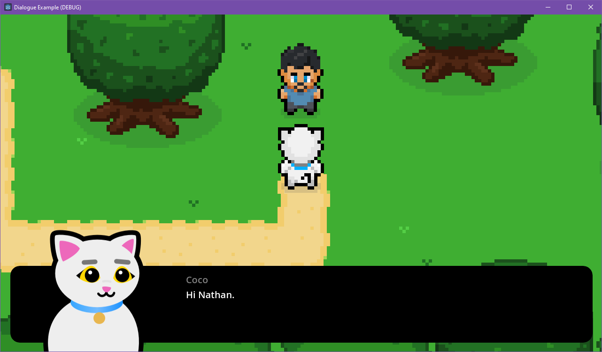

# Dialogue Manager Example: Balloon with portraits

This is an example project that demonstrates portrait-style dialogue balloons in Godot 4 using the [Dialogue Manager](https://github.com/nathanhoad/godot_dialogue_manager) addon.

This example comes in both GDScript and C# flavours. Both are the same example, just implemented in the given language.

The project includes:

- Triggering dialogue in a 2D world when pressing spacebar near an NPC.
- A custom dialogue balloon that was generated from the example balloon (including a special state for "notification" style dialogue).
- Showing character portraits alongside dialogue.
- Animating those portraits by using tags in the dialogue.
- Talking beeps while characters are talking.
- Interfacing with game state via an autoload.

Feel free to use this project as a starting point or reference for your own dialogue balloon.

## Project layout

- `addons` includes the [Dialogue Manager](https://github.com/nathanhoad/godot_dialogue_manager) addon.
- `characters` contains the files for each character, both the in-world character and their dialogue portrait.
- `dialogue` contains the assets for the dialogue balloon.
- `helpers` has the files for a few odds and ends.
- `scenes` contains the world scene and its corresponding dialogue file.
- `world` includes assets used to create scenes - stuff like trees and the world tileset.

### How portraits work

Character portraits are found in the `characters` folder under their name (lowercased) as `portrait.tscn`. These portrait scenes extend the `BasePortrait` class which expects an `AnimationPlayer` to be found at `%AnimationPlayer` to provide the `emote` method.

To add your own emotions, add each with a new animation on the AnimationPlayer named to match the tags you'll use in the dialogue. For example, you'll see that Coco has a `shady` animation that matches the `[#shady]` tag used in the dialogue.

## Dialogue Manager

[Dialogue Manager](https://github.com/nathanhoad/godot_dialogue_manager) is a Godot addon for writing and running nonlinear dialogue. It is available via GitHub and the AssetLib.
